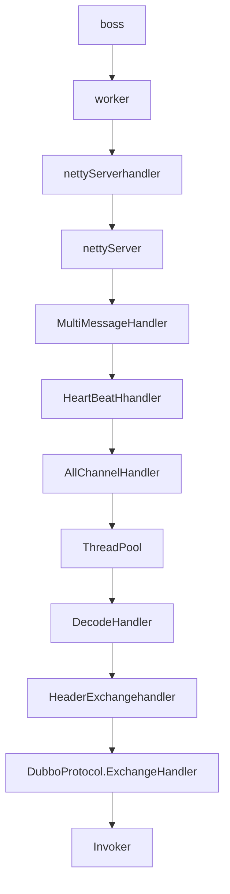

# Dubbo系列-服务端调用流程解析

[toc]

## 流程解析

接第二章，我们知道了dubbo服务端暴露dubbo协议的服务是在DubboProtocol类中进行的。

```java
    @Override
    public <T> Exporter<T> export(Invoker<T> invoker) throws RpcException {
        URL url = invoker.getUrl();

        //按照serviceKey，将DubboExporter存入map中
        String key = serviceKey(url);
        DubboExporter<T> exporter = new DubboExporter<T>(invoker, key, exporterMap);
        exporterMap.put(key, exporter);

        
        Boolean isStubSupportEvent = url.getParameter(Constants.STUB_EVENT_KEY, Constants.DEFAULT_STUB_EVENT);
        Boolean isCallbackservice = url.getParameter(Constants.IS_CALLBACK_SERVICE, false);
        if (isStubSupportEvent && !isCallbackservice) {
            String stubServiceMethods = url.getParameter(Constants.STUB_EVENT_METHODS_KEY);
            if (stubServiceMethods == null || stubServiceMethods.length() == 0) {
                if (logger.isWarnEnabled()) {
                    logger.warn(new IllegalStateException("consumer [" + url.getParameter(Constants.INTERFACE_KEY) +
                            "], has set stubproxy support event ,but no stub methods founded."));
                }
            } else {
                stubServiceMethodsMap.put(url.getServiceKey(), stubServiceMethods);
            }
        }

        //开启服务
        openServer(url);
        optimizeSerialization(url);
        return exporter;
    }

    private void openServer(URL url) {
        // find server.
        String key = url.getAddress();
        //client can export a service which's only for server to invoke
        boolean isServer = url.getParameter(Constants.IS_SERVER_KEY, true);
        if (isServer) {
            ExchangeServer server = serverMap.get(key);
            if (server == null) {
                //如果服务没有启动的话，调用createService方法来启动服务。
                //注意key是address，这里保证了一个address地址只会启动一次
                serverMap.put(key, createServer(url));
            } else {
                // server supports reset, use together with override
                server.reset(url);
            }
        }
    }

    private ExchangeServer createServer(URL url) {
        // send readonly event when server closes, it's enabled by default
        url = url.addParameterIfAbsent(Constants.CHANNEL_READONLYEVENT_SENT_KEY, Boolean.TRUE.toString());
        // enable heartbeat by default
        url = url.addParameterIfAbsent(Constants.HEARTBEAT_KEY, String.valueOf(Constants.DEFAULT_HEARTBEAT));
        //默认使用netty服务
        String str = url.getParameter(Constants.SERVER_KEY, Constants.DEFAULT_REMOTING_SERVER);

        if (str != null && str.length() > 0 && !ExtensionLoader.getExtensionLoader(Transporter.class).hasExtension(str))
            throw new RpcException("Unsupported server type: " + str + ", url: " + url);

        //这里写入默认的解码器参数
        url = url.addParameter(Constants.CODEC_KEY, DubboCodec.NAME);
        ExchangeServer server;
        try {
            //最后调用Exchangers的静态方法来启动服务.
            server = Exchangers.bind(url, requestHandler);
        } catch (RemotingException e) {
            throw new RpcException("Fail to start server(url: " + url + ") " + e.getMessage(), e);
        }
        str = url.getParameter(Constants.CLIENT_KEY);
        if (str != null && str.length() > 0) {
            Set<String> supportedTypes = ExtensionLoader.getExtensionLoader(Transporter.class).getSupportedExtensions();
            if (!supportedTypes.contains(str)) {
                throw new RpcException("Unsupported client type: " + str);
            }
        }
        return server;
    }

```
我们这里先不管`Invoker`对象是做什么的，可以看到在暴露服务前，dubbo先将`invoker`对象封装进`DubboExporter`对象中，然后存到一个`map`对象里。在最后调用`bind`接口时，除了传入`url`外，还会传入`requestHandler`对象，我们先看下`requestHandler`对象是做什么的。


```java
    private ExchangeHandler requestHandler = new ExchangeHandlerAdapter() {

        @Override
        public Object reply(ExchangeChannel channel, Object message) throws RemotingException {
            if (message instanceof Invocation) {
                Invocation inv = (Invocation) message;
                //从exporterMap中获取invoker对象
                Invoker<?> invoker = getInvoker(channel, inv);
                // need to consider backward-compatibility if it's a callback
                if (Boolean.TRUE.toString().equals(inv.getAttachments().get(IS_CALLBACK_SERVICE_INVOKE))) {
                    String methodsStr = invoker.getUrl().getParameters().get("methods");
                    boolean hasMethod = false;
                    if (methodsStr == null || methodsStr.indexOf(",") == -1) {
                        hasMethod = inv.getMethodName().equals(methodsStr);
                    } else {
                        String[] methods = methodsStr.split(",");
                        for (String method : methods) {
                            if (inv.getMethodName().equals(method)) {
                                hasMethod = true;
                                break;
                            }
                        }
                    }
                    if (!hasMethod) {
                        logger.warn(new IllegalStateException("The methodName " + inv.getMethodName()
                                + " not found in callback service interface ,invoke will be ignored."
                                + " please update the api interface. url is:"
                                + invoker.getUrl()) + " ,invocation is :" + inv);
                        return null;
                    }
                }
                RpcContext.getContext().setRemoteAddress(channel.getRemoteAddress());
                return invoker.invoke(inv);
            }
            throw new RemotingException(channel, "Unsupported request: "
                    + (message == null ? null : (message.getClass().getName() + ": " + message))
                    + ", channel: consumer: " + channel.getRemoteAddress() + " --> provider: " + channel.getLocalAddress());
        }

        @Override
        public void received(Channel channel, Object message) throws RemotingException {
            if (message instanceof Invocation) {
                reply((ExchangeChannel) channel, message);
            } else {
                super.received(channel, message);
            }
        }

        @Override
        public void connected(Channel channel) throws RemotingException {
            invoke(channel, Constants.ON_CONNECT_KEY);
        }

        @Override
        public void disconnected(Channel channel) throws RemotingException {
            if (logger.isInfoEnabled()) {
                logger.info("disconnected from " + channel.getRemoteAddress() + ",url:" + channel.getUrl());
            }
            invoke(channel, Constants.ON_DISCONNECT_KEY);
        }

        private void invoke(Channel channel, String methodKey) {
            Invocation invocation = createInvocation(channel, channel.getUrl(), methodKey);
            if (invocation != null) {
                try {
                    received(channel, invocation);
                } catch (Throwable t) {
                    logger.warn("Failed to invoke event method " + invocation.getMethodName() + "(), cause: " + t.getMessage(), t);
                }
            }
        }

        private Invocation createInvocation(Channel channel, URL url, String methodKey) {
            String method = url.getParameter(methodKey);
            if (method == null || method.length() == 0) {
                return null;
            }
            RpcInvocation invocation = new RpcInvocation(method, new Class<?>[0], new Object[0]);
            invocation.setAttachment(Constants.PATH_KEY, url.getPath());
            invocation.setAttachment(Constants.GROUP_KEY, url.getParameter(Constants.GROUP_KEY));
            invocation.setAttachment(Constants.INTERFACE_KEY, url.getParameter(Constants.INTERFACE_KEY));
            invocation.setAttachment(Constants.VERSION_KEY, url.getParameter(Constants.VERSION_KEY));
            if (url.getParameter(Constants.STUB_EVENT_KEY, false)) {
                invocation.setAttachment(Constants.STUB_EVENT_KEY, Boolean.TRUE.toString());
            }
            return invocation;
        }
    };
```
通过`requestHandler`的实现方法我们可以看到它主要用来处理各种请求回调，我们重点关注`reply`的回调方法，主要做了3件事情：
1. 从exporterMap获取具体的invoker对象。
2. 判断调用的method是否存在。
3. 调用`invoker.invoke`。

我们继续深入`Exchangers.bind`。

```java
    public static ExchangeServer bind(URL url, ExchangeHandler handler) throws RemotingException {
        if (url == null) {
            throw new IllegalArgumentException("url == null");
        }
        if (handler == null) {
            throw new IllegalArgumentException("handler == null");
        }
        url = url.addParameterIfAbsent(Constants.CODEC_KEY, "exchange");
        return getExchanger(url).bind(url, handler);
    }
    
    public static Exchanger getExchanger(URL url) {
        String type = url.getParameter(Constants.EXCHANGER_KEY, Constants.DEFAULT_EXCHANGER);
        return getExchanger(type);
    }
    
    public static Exchanger getExchanger(String type) {
        return ExtensionLoader.getExtensionLoader(Exchanger.class).getExtension(type);
    }
```

`Exchangers.bind`主要做了2件事情：
1. 获取`Exchanger`对象，这里根据SPI默认获取`HeaderExchanger`，实际上`Exchanger`也只有这么一个实现类。
2. 调用`Exchanger`的`bind`方法，返回`ExchangeServer`对象。

我们再看`HeaderExchanger`的`bind`代码。

```java
    @Override
    public ExchangeServer bind(URL url, ExchangeHandler handler) throws RemotingException {
        return new HeaderExchangeServer(Transporters.bind(url, new DecodeHandler(new HeaderExchangeHandler(handler))));
    }
```

`HeaderExchanger` 主要3件事情：
1. 封装`handler`对象，外面分别套了一个`HeaderExchangeHandler`和`DecodeHandler`。
2. `Transporters.bind`开启服务，传入`url`和`ChannelHandler`两个参数，返回`Server`。
3. 初始化`HeaderExchangeServer`对象并返回。

我们先看`HeaderExchangeServer`做了什么事情。

```java
    public HeaderExchangeServer(Server server) {
        if (server == null) {
            throw new IllegalArgumentException("server == null");
        }
        this.server = server;
        this.heartbeat = server.getUrl().getParameter(Constants.HEARTBEAT_KEY, 0);
        this.heartbeatTimeout = server.getUrl().getParameter(Constants.HEARTBEAT_TIMEOUT_KEY, heartbeat * 3);
        if (heartbeatTimeout < heartbeat * 2) {
            throw new IllegalStateException("heartbeatTimeout < heartbeatInterval * 2");
        }
        startHeartbeatTimer();
    }
    
    private void startHeartbeatTimer() {
        stopHeartbeatTimer();
        if (heartbeat > 0) {
            heartbeatTimer = scheduled.scheduleWithFixedDelay(
                    new HeartBeatTask(new HeartBeatTask.ChannelProvider() {
                        @Override
                        public Collection<Channel> getChannels() {
                            return Collections.unmodifiableCollection(
                                    HeaderExchangeServer.this.getChannels());
                        }
                    }, heartbeat, heartbeatTimeout),
                    heartbeat, heartbeat, TimeUnit.MILLISECONDS);
        }
    }

    private void stopHeartbeatTimer() {
        try {
            ScheduledFuture<?> timer = heartbeatTimer;
            if (timer != null && !timer.isCancelled()) {
                timer.cancel(true);
            }
        } catch (Throwable t) {
            logger.warn(t.getMessage(), t);
        } finally {
            heartbeatTimer = null;
        }
    }
    
    @Override
    public void close() {
        doClose();
        server.close();
    }
    
    ...

```

`HeaderExchangeServer`主要是封装了server对象，并通过`ScheduledExecutorService`来定时向客户端发送心跳。心跳在这里不详细分析，我们继续深入`Transporters.bind`看服务是如何暴露的。

```java
    public static Server bind(URL url, ChannelHandler... handlers) throws RemotingException {
        if (url == null) {
            throw new IllegalArgumentException("url == null");
        }
        if (handlers == null || handlers.length == 0) {
            throw new IllegalArgumentException("handlers == null");
        }
        ChannelHandler handler;
        if (handlers.length == 1) {
            handler = handlers[0];
        } else {
            handler = new ChannelHandlerDispatcher(handlers);
        }
        return getTransporter().bind(url, handler);
    }
    
    public static Transporter getTransporter() {
        return ExtensionLoader.getExtensionLoader(Transporter.class).getAdaptiveExtension();
    }
```

`Transporters.bind`主要做的两件事情：
1. 通过`SPI`找到`Transporter`对象，这里默认使用`NettyTransporter`。
2. 调用`NettyTransporter.bind`

```java
    @Override
    public Server bind(URL url, ChannelHandler listener) throws RemotingException {
        return new NettyServer(url, listener);
    }
```

`NettyTransporter.bind`方法初始化了一个`NettyServer`。

```java
    public NettyServer(URL url, ChannelHandler handler) throws RemotingException {
        //封装ChannelHandler，调用父类的初始化方法。最终会调到doOpen方法上。
        super(url, ChannelHandlers.wrap(handler, ExecutorUtil.setThreadName(url, SERVER_THREAD_POOL_NAME)));
    }

    @Override
    protected void doOpen() throws Throwable {
        bootstrap = new ServerBootstrap();
        //一个boss线程和核数+1（最大不超过32）的worker线程
        bossGroup = new NioEventLoopGroup(1, new DefaultThreadFactory("NettyServerBoss", true));
        workerGroup = new NioEventLoopGroup(getUrl().getPositiveParameter(Constants.IO_THREADS_KEY, Constants.DEFAULT_IO_THREADS),
                new DefaultThreadFactory("NettyServerWorker", true));

        final NettyServerHandler nettyServerHandler = new NettyServerHandler(getUrl(), this);
        channels = nettyServerHandler.getChannels();

        bootstrap.group(bossGroup, workerGroup)
                .channel(NioServerSocketChannel.class)
                //禁用nagle算法，防止粘包
                .childOption(ChannelOption.TCP_NODELAY, Boolean.TRUE)
                //允许重复使用本地地址和端口
                .childOption(ChannelOption.SO_REUSEADDR, Boolean.TRUE)
                //ByteBuf分配器
                .childOption(ChannelOption.ALLOCATOR, PooledByteBufAllocator.DEFAULT)
                .childHandler(new ChannelInitializer<NioSocketChannel>() {
                    @Override
                    protected void initChannel(NioSocketChannel ch) throws Exception {
                        //根据之前写入的codec，getCodec()默认获取DubboCountCodec
                        NettyCodecAdapter adapter = new NettyCodecAdapter(getCodec(), getUrl(), NettyServer.this);
                        ch.pipeline()
                                .addLast("decoder", adapter.getDecoder())
                                .addLast("encoder", adapter.getEncoder())
                                .addLast("handler", nettyServerHandler);
                    }
                });
        // bind
        ChannelFuture channelFuture = bootstrap.bind(getBindAddress());
        channelFuture.syncUninterruptibly();
        channel = channelFuture.channel();

    }
```

`NettyServer`主要做的几件事情:

1. 初始化时对`ChannelHandler`进行封装。
2. 初始化`NettyServerHandler`，并传入`NettyServer`自身。
3. 初始化`netty`的`ServerBootstrap`，注册3三个`ChannelHandler`。
4. 启动服务。

`dubbo`编解码相关的以后单独讲，我们继续深入`nettyServerHandler`。

```java
public class NettyServerHandler extends ChannelDuplexHandler {
    private final ChannelHandler handler;

    public NettyServerHandler(URL url, ChannelHandler handler) {
        if (url == null) {
            throw new IllegalArgumentException("url == null");
        }
        if (handler == null) {
            throw new IllegalArgumentException("handler == null");
        }
        this.url = url;
        this.handler = handler;
    }
    
    ...

    @Override
    public void channelRead(ChannelHandlerContext ctx, Object msg) throws Exception {
        NettyChannel channel = NettyChannel.getOrAddChannel(ctx.channel(), url, handler);
        try {
            handler.received(channel, msg);
        } finally {
            NettyChannel.removeChannelIfDisconnected(ctx.channel());
        }
    }
    
    ...


    @Override
    public void write(ChannelHandlerContext ctx, Object msg, ChannelPromise promise) throws Exception {
        super.write(ctx, msg, promise);
        NettyChannel channel = NettyChannel.getOrAddChannel(ctx.channel(), url, handler);
        try {
            handler.sent(channel, msg);
        } finally {
            NettyChannel.removeChannelIfDisconnected(ctx.channel());
        }
    }
    
    ...
}
```

`NettyServerHandler`继承`netty`的`ChannelDuplexHandler`，实现了`channelRead`和`write`两个方法，最终调用`ChannelHandler`的`received`和`sent`方法。`NettyServerHandler`可以看成是`netty`的`channelHandler`和`dubbo`的`channelHandler`的转换。


根据类图可以看到`NettyServer`实现了`dubbo`的`channelHandler`，其`sent`方法和`received`方法主要在父类`AbstractPeer`中实现。

```java
public abstract class AbstractPeer implements Endpoint, ChannelHandler {
    public AbstractPeer(URL url, ChannelHandler handler) {
        if (url == null) {
            throw new IllegalArgumentException("url == null");
        }
        if (handler == null) {
            throw new IllegalArgumentException("handler == null");
        }
        this.url = url;
        this.handler = handler;
    }
    
    @Override
    public void sent(Channel ch, Object msg) throws RemotingException {
        if (closed) {
            return;
        }
        handler.sent(ch, msg);
    }

    @Override
    public void received(Channel ch, Object msg) throws RemotingException {
        if (closed) {
            return;
        }
        handler.received(ch, msg);
    }

```

`AbstractPeer`调用`ChannelHandler`的`sent`和`received`方法。而`ChannelHandler`是在`NettyServer`初始化时传入的。

```java
    public NettyServer(URL url, ChannelHandler handler) throws RemotingException {
        super(url, ChannelHandlers.wrap(handler, ExecutorUtil.setThreadName(url, SERVER_THREAD_POOL_NAME)));
    }
```

`ExecutorUtil.setThreadName`在url加了一个线程名的参数`DubboServerHandler`，在传入`handler`前，`ChannelHandlers.wrap`对`handler`进行了封装。

```java
public class ChannelHandlers {

    private static ChannelHandlers INSTANCE = new ChannelHandlers();

    protected ChannelHandlers() {
    }

    public static ChannelHandler wrap(ChannelHandler handler, URL url) {
        return ChannelHandlers.getInstance().wrapInternal(handler, url);
    }

    protected static ChannelHandlers getInstance() {
        return INSTANCE;
    }

    static void setTestingChannelHandlers(ChannelHandlers instance) {
        INSTANCE = instance;
    }

    protected ChannelHandler wrapInternal(ChannelHandler handler, URL url) {
        return new MultiMessageHandler(new HeartbeatHandler(ExtensionLoader.getExtensionLoader(Dispatcher.class)
                .getAdaptiveExtension().dispatch(handler, url)));
    }
}
```
在`wrapInternal`方法中，对`handler`进行了3次的封装：
1. `Dispatcher.dispatch`
2. `HeartbeatHandler`
3. `MultiMessageHandler`

我们依次来看这3个`ChannelHandler`各做什么事情。首先`Dispatcher`是个SPI，默认会使用`AllDispatcher`。

```java
public class AllDispatcher implements Dispatcher {

    public static final String NAME = "all";

    @Override
    public ChannelHandler dispatch(ChannelHandler handler, URL url) {
        return new AllChannelHandler(handler, url);
    }

}
```

```java
public class AllChannelHandler extends WrappedChannelHandler {
    ...
    
    @Override
    public void received(Channel channel, Object message) throws RemotingException {
        ExecutorService cexecutor = getExecutorService();
        try {
            cexecutor.execute(new ChannelEventRunnable(channel, handler, ChannelState.RECEIVED, message));
        } catch (Throwable t) {
            //TODO A temporary solution to the problem that the exception information can not be sent to the opposite end after the thread pool is full. Need a refactoring
            //fix The thread pool is full, refuses to call, does not return, and causes the consumer to wait for time out
        	if(message instanceof Request && t instanceof RejectedExecutionException){
        		Request request = (Request)message;
        		if(request.isTwoWay()){
        			String msg = "Server side(" + url.getIp() + "," + url.getPort() + ") threadpool is exhausted ,detail msg:" + t.getMessage();
        			Response response = new Response(request.getId(), request.getVersion());
        			response.setStatus(Response.SERVER_THREADPOOL_EXHAUSTED_ERROR);
        			response.setErrorMessage(msg);
        			channel.send(response);
        			return;
        		}
        	}
            throw new ExecutionException(message, channel, getClass() + " error when process received event .", t);
        }
    }
}
```

```java
public class ChannelEventRunnable implements Runnable {

@Override
    public void run() {
        if (state == ChannelState.RECEIVED) {
            try {
                handler.received(channel, message);
            } catch (Exception e) {
                logger.warn("ChannelEventRunnable handle " + state + " operation error, channel is " + channel
                        + ", message is " + message, e);
            }
        } else {
            switch (state) {
            case CONNECTED:
                try {
                    handler.connected(channel);
                } catch (Exception e) {
                    logger.warn("ChannelEventRunnable handle " + state + " operation error, channel is " + channel, e);
                }
                break;
            case DISCONNECTED:
                try {
                    handler.disconnected(channel);
                } catch (Exception e) {
                    logger.warn("ChannelEventRunnable handle " + state + " operation error, channel is " + channel, e);
                }
                break;
            case SENT:
                try {
                    handler.sent(channel, message);
                } catch (Exception e) {
                    logger.warn("ChannelEventRunnable handle " + state + " operation error, channel is " + channel
                            + ", message is " + message, e);
                }
            case CAUGHT:
                try {
                    handler.caught(channel, exception);
                } catch (Exception e) {
                    logger.warn("ChannelEventRunnable handle " + state + " operation error, channel is " + channel
                            + ", message is: " + message + ", exception is " + exception, e);
                }
                break;
            default:
                logger.warn("unknown state: " + state + ", message is " + message);
            }
        }

    }
}
```

`AllChannelHandler`做的事情其实就是将具体的业务处理代码放入线程池。`ChannelEventRunnable`中的代码看起来有点怪异，其实是CPU分支预测的优化，具体查看[优化技巧：提前if判断帮助CPU分支预测](http://hengyunabc.github.io/optimization-tip-if-vs-switch/)

这里可以总结一下`dubbo`的几个线程池和`Dispatcher`。

**Dispatcher**

* all:所有消息都派发到线程池，包括请求、响应、连接事件、断开事件、心跳等。
* direct:所有消息都不派发到线程池，全部在IO线程上直接执行。
* message:只有请求响应消息派发到线程池，其他连接断开事件、心跳等消息，直接在IO线程上执行。
* execution:只请求消息派发到线程池，不含响应，响应和其他连接断开事件、心跳等消息，直接在IO线程上执行。
* connection:在IO线程上，将连接断开事件放入队列，有序逐个执行，其他消息派发到线程池。

**ThreadPool**

* fixed:固定大小线程池，启动时建立线程，不关闭，一直持有。（缺省）
* cached:缓存线程池，空闲一分钟自动删除，需要时重建。
* limited:可伸缩线程池，但池中的线程只会增长不会收缩。（为避免收缩时突然来了大流量引起的性能问题）。

接下来看`HeartbeatHandler`。

```java
public class HeartbeatHandler extends AbstractChannelHandlerDelegate {
    ...
    @Override
    public void received(Channel channel, Object message) throws RemotingException {
        setReadTimestamp(channel);
        //判断是否是心跳
        if (isHeartbeatRequest(message)) {
            Request req = (Request) message;
            if (req.isTwoWay()) {
                //发送心跳返回
                Response res = new Response(req.getId(), req.getVersion());
                res.setEvent(Response.HEARTBEAT_EVENT);
                channel.send(res);
                if (logger.isInfoEnabled()) {
                    int heartbeat = channel.getUrl().getParameter(Constants.HEARTBEAT_KEY, 0);
                    if (logger.isDebugEnabled()) {
                        logger.debug("Received heartbeat from remote channel " + channel.getRemoteAddress()
                                + ", cause: The channel has no data-transmission exceeds a heartbeat period"
                                + (heartbeat > 0 ? ": " + heartbeat + "ms" : ""));
                    }
                }
            }
            return;
        }
        if (isHeartbeatResponse(message)) {
            if (logger.isDebugEnabled()) {
                logger.debug("Receive heartbeat response in thread " + Thread.currentThread().getName());
            }
            return;
        }
        handler.received(channel, message);
    }

    private boolean isHeartbeatRequest(Object message) {
        return message instanceof Request && ((Request) message).isHeartbeat();
    }
    ...
}
```

`HeartbeatHandler`负责处理接收到的心跳。


```java
public class MultiMessageHandler extends AbstractChannelHandlerDelegate {

    public MultiMessageHandler(ChannelHandler handler) {
        super(handler);
    }

    @SuppressWarnings("unchecked")
    @Override
    public void received(Channel channel, Object message) throws RemotingException {
        if (message instanceof MultiMessage) {
            MultiMessage list = (MultiMessage) message;
            for (Object obj : list) {
                handler.received(channel, obj);
            }
        } else {
            handler.received(channel, message);
        }
    }
}
```

`MultiMessageHandler`如果是批量请求，则依次对请求调用下一个Handler来处理。

```java
public class DecodeHandler extends AbstractChannelHandlerDelegate {

    private static final Logger log = LoggerFactory.getLogger(DecodeHandler.class);

    public DecodeHandler(ChannelHandler handler) {
        super(handler);
    }

    @Override
    public void received(Channel channel, Object message) throws RemotingException {
        if (message instanceof Decodeable) {
            decode(message);
        }

        if (message instanceof Request) {
            decode(((Request) message).getData());
        }

        if (message instanceof Response) {
            decode(((Response) message).getResult());
        }

        handler.received(channel, message);
    }

    private void decode(Object message) {
        if (message != null && message instanceof Decodeable) {
            try {
                ((Decodeable) message).decode();
                if (log.isDebugEnabled()) {
                    log.debug("Decode decodeable message " + message.getClass().getName());
                }
            } catch (Throwable e) {
                if (log.isWarnEnabled()) {
                    log.warn("Call Decodeable.decode failed: " + e.getMessage(), e);
                }
            } // ~ end of catch
        } // ~ end of if
    } // ~ end of method decode
}
```
接下来会调用`DecodeHandler`，`DecodeHandler`调用`message`的`decode`方法进行序列化。

**HeaderExchangeHandler**
```java
public class HeaderExchangeHandler implements ChannelHandlerDelegate {
    @Override
    public void received(Channel channel, Object message) throws RemotingException {
        channel.setAttribute(KEY_READ_TIMESTAMP, System.currentTimeMillis());
        ExchangeChannel exchangeChannel = HeaderExchangeChannel.getOrAddChannel(channel);
        try {
            //服务端接受request
            if (message instanceof Request) {
                // handle request.
                Request request = (Request) message;
                if (request.isEvent()) {
                    handlerEvent(channel, request);
                } else {
                    if (request.isTwoWay()) {
                        Response response = handleRequest(exchangeChannel, request);
                        channel.send(response);
                    } else {
                        handler.received(exchangeChannel, request.getData());
                    }
                }
            //客户端接受response
            } else if (message instanceof Response) {
                handleResponse(channel, (Response) message);
            } else if (message instanceof String) {
                if (isClientSide(channel)) {
                    Exception e = new Exception("Dubbo client can not supported string message: " + message + " in channel: " + channel + ", url: " + channel.getUrl());
                    logger.error(e.getMessage(), e);
                } else {
                    //如果是String类型的，调用telnet方法。
                    String echo = handler.telnet(channel, (String) message);
                    if (echo != null && echo.length() > 0) {
                        channel.send(echo);
                    }
                }
            } else {
                handler.received(exchangeChannel, message);
            }
        } finally {
            HeaderExchangeChannel.removeChannelIfDisconnected(channel);
        }
    }

}
```


最后经过层层过滤回到`DubboProtocol`的`ExchangeHandler`上，通过`invoker.invoke(Invocation)`调到具体的业务代码上。

### Invoker

待补充。。。

***
## 总结

### 线程模型


在使用默认`AllDispatcher`的情况下，`Dubbo`的线程模型为 *1+M+N*的模型，即1个acceptor线程，M个IO线程，N个业务线程。


### 调用流程图


